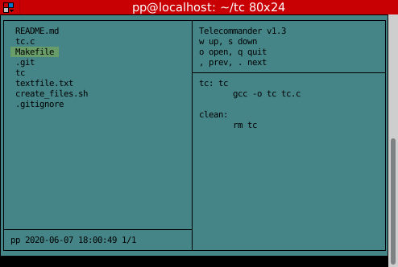

# telecommander



A re-implementation of telecommander (tc) as seen on telehack.

Heavily inspired by Norton Commander.

### Installation

```
git clone https://github.com/p85/tc
cd tc
make
```

### Usage

`./tc`

### Notes

* does not need UTF-8 to print Drawing Box Characters

